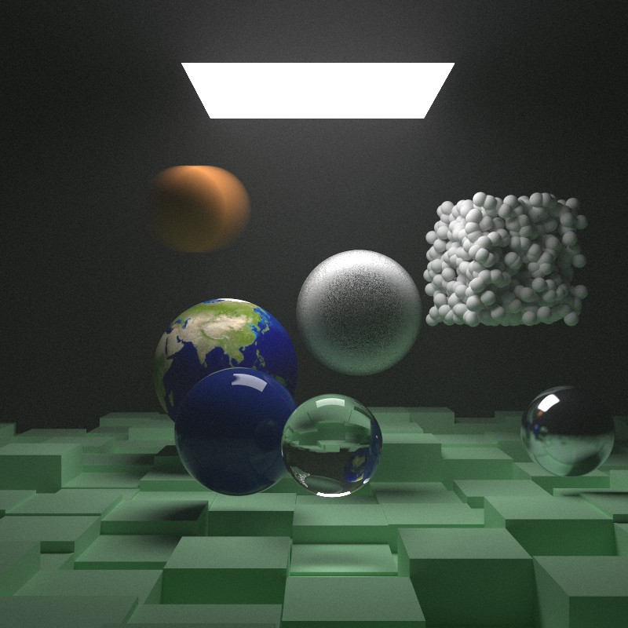
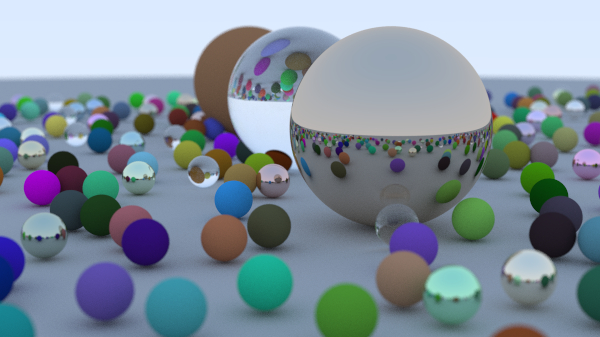
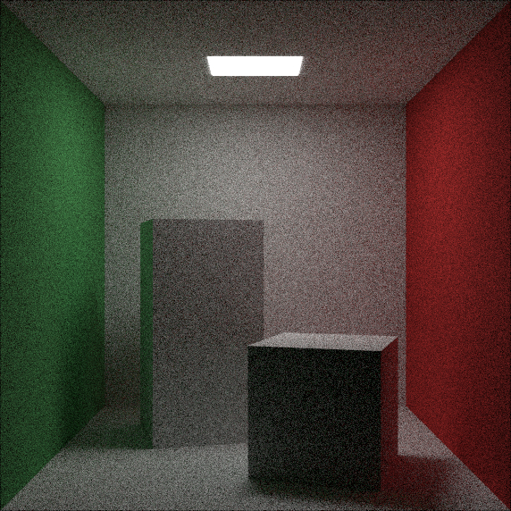
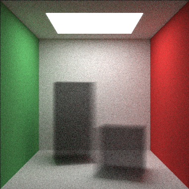
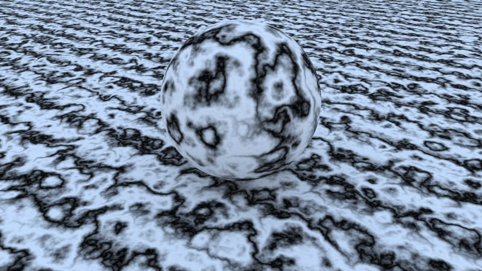

# Raytracer
Multithreaded software-based raytracer 

    

  
This is a raytracer based on the books *Raytracing in One Weekend* and *Raytracing The Next Week* by Peter Shirley, for which the books and reference code can be found [in this repo.](https://github.com/RayTracing/raytracing.github.io) The design is mostly the same as described in the books with a few modifications, the main one being that this implementation uses multithreading for better performance.

## Overview

The main method used is path tracing in which rays are shot from a camera into the scene where they hit and bounce off of surfaces until they terminate at a light source. Several rays are shot for each pixel of the final output image in order to gather more samples for rendering a more accurate image. The more samples used, the more accurate and higher quality the image. Conversely, for lower number of samples, the output image will tend to be grainy or noisy. The final output image can be stored either as an uncompressed ppm file or a compressed jpg file.

Currently, rendering support extends to a handful of primitive shapes and a few different materials. Volumes whose boundaries are defined by a primitive shape are also supported. Only physical lights are supported which must be defined by a primitive shape and an appropriate light-emitting material.

Multithreading is used in order to speed up the rendering. The speedup is roughly proportional to the number of processing cores on the machine executing the program. 

    

## Main features

The following is a summary of rendering-focused features the raytracer supports:

Primitives supported:
* Spheres
* Rectangles
* Boxes

    

Materials Supported:
* Lambertian/Diffuse
* Metal
* Dielectrics
* Isotropic

    

Textures supported:
* Solid colors
* Checker pattern
* Image textures
* Noise textures (based on Perlin noise)

    

Since this is a software-based raytracer, it takes a substantial amount of time to render even simple scenes with a moderately high number of samples. Thus, several measures have been taken to improve the performance of the code. Most significantly, multithreading is used to split up the workload between several processing cores which leads to a notable improvement in rendering speed on machines that have multicore processors. 

On the algorithm side, a Bounding Volume Hierarchy (BVH) structure is used in order to speed up the ray-object intersection checks. This reduces the intersection checking code from being O(n) where n is the number of objects in the scene to O(log n) by creating bounding volumes around the objects in a hierarchical manner and checking for intersections against the bounding volumes instead of the objects. 

Lastly, for the random number generation, the [fastPRNG](https://github.com/BrutPitt/fastPRNG) library was used, specifically the xoshiro256+ algorithm, which is faster than the Mersenne Twister generator used in the *Raytracing in One Weekend* book.
